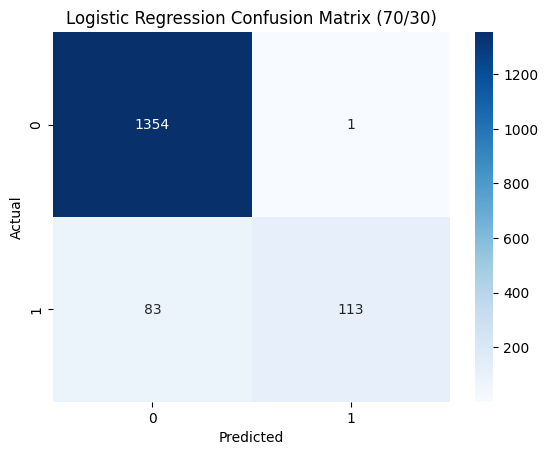
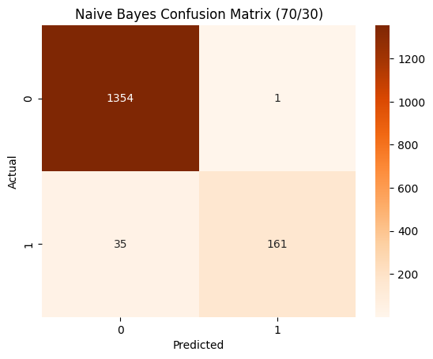
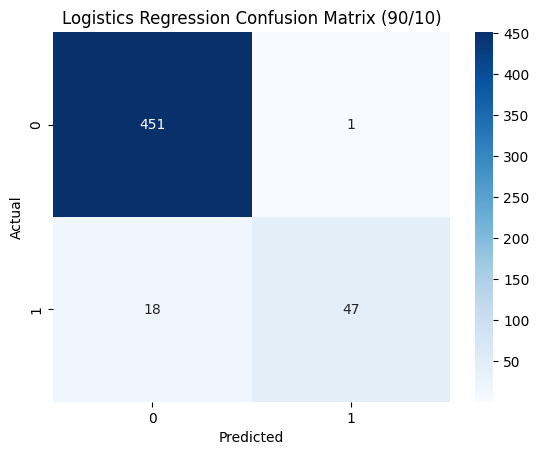
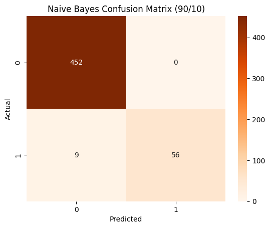
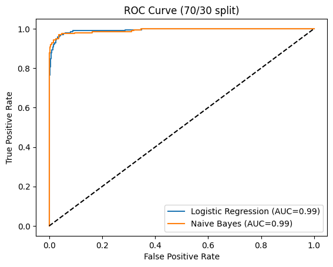
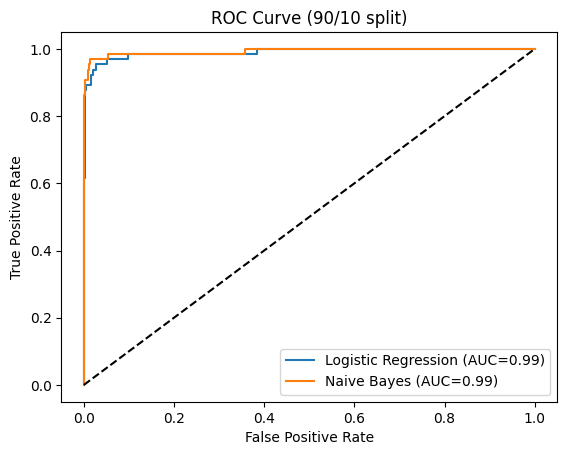

# SMS Spam Detection: Logistic Regression vs. Naive Bayes

## Overview
Built and compared two ML classifiers (Logistic Regression, Naive Bayes)
to detect spam in SMS messages, evaluating performance across two
train/test split ratios (70/30, 90/10).

## Techniques Used
- TF-IDF vectorization
- Train/test splitting with stratification
- Confusion matrices, ROC/AUC curves
- Class imbalance analysis

## Confusion Matrices

### 70/30 Split

### 90/10 Split

## ROC Curves

### 70/30 Split

### 90/10 Split

## Key Results & Findings
| Metric | LR (70/30) | NB (70/30) | LR (90/10) | NB (90/10) |
|---|---|---|---|---|
| Accuracy | 94.6% | 97.7% | 96.3% | 98.3% |
| Precision | 99.1% | 99.4% | 97.9% | 100% |
| Recall | 57.7% | 82.1% | 72.3% | 86.2% |
| F1 Score | 72.9% | 89.9% | 83.2% | 92.6% |

Naive Bayes outperformed Logistic Regression across every metric,
particularly recall — catching significantly more actual spam.
